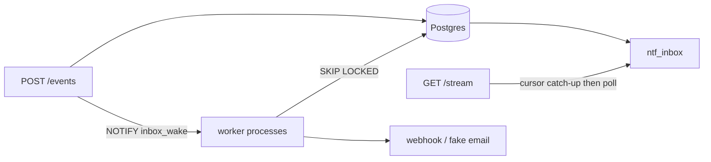

# Architecture

Inbox id is monotonic per insert. Catch-up is `id > cursor`. Replay capped at `REPLAY_CAP`; beyond that the stream emits `cursor_expired` and points at `/inbox`. After catch-up, SSE sleeps `POLL_INTERVAL_SECONDS` and queries again (`api.py`). That is deliberate: the browser path does not hold a LISTEN connection.

`NOTIFY inbox_wake` is issued on publish and chunked fan-out (`plane.notify_live`). Workers `LISTEN` when `WAKE_MODE=listen` so delivery and V2 fan-out claims are not stuck on a full idle poll. A missed notify cannot stall them; the listen wait has the same timeout.

Webhook workers are a separate process from the API. A slow `fake://slow` destination holds one lease; other deliveries proceed.

There is no Redis or application-level cache. Durability is the inbox table.
